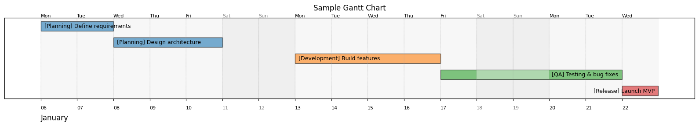
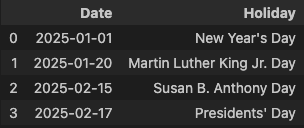

## 📊 Gantt Chart Visualization for OKRs and Projects

This module provides a lightweight framework to define, estimate, and visualize timelines for OKRs, planning, and sequential tasks. Charts are rendered using `matplotlib` with custom background shading, weekday/month labeling, and holiday-aware scheduling.

---

### 🧪 Example: Visualize a Project Timeline

```python
from okr.plot import styled_gantt
from okr.gantt import build_gantt_sequence
from okr.workdays import get_holidays

timeline = [
    (2, "Planning", "Define requirements"),
    (3, "Planning", "Design architecture"),
    (4, "Development", "Build features"),
    (2, "QA", "Testing & bug fixes"),
    (1, "Release", "Launch MVP"),
]

holidays = get_holidays("US", "2025-01-01", "2025-02-28", subdiv="CA")
df, = build_gantt_sequence([timeline], "2025-01-06", non_workdays=holidays.Date.to_list())

styled_gantt(df, "Sample Gantt Chart")
```


You can pass optional arguments to adjust layout, grouping, and labeling:

```python
styled_gantt(
    df,
    title="Custom Gantt",
    label_fontsize=10,
    max_label_length=40,
    weekday_label_length=2,
    include_group_name=False
)
```


### 📆 Holiday-aware Scheduling and Workday Estimation
You can fetch official holidays for a specific country and region, then estimate the number of workdays in a given interval:

```python
from okr.workdays import get_holidays, estimate_workdays

# Get holidays in California (USA)
holidays = get_holidays("US", "2025-01-01", "2025-02-28", subdiv="CA")
holidays
```



```python
# Estimate workdays excluding weekends and holidays
workdays = estimate_workdays("2025-01-01", "2025-02-28", non_workdays=holidays.Date.to_list())

print(workdays)
# Output: 40
```